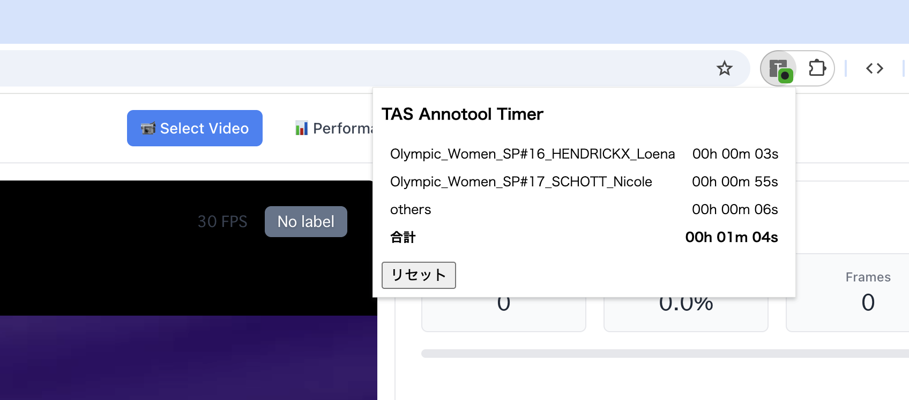

# TAS-Annotool timer

## 概要
[TAS-AnnoTools](https://github.com/ryota-skating/TAS-AnnoTools)の作業時間を計測するChrome拡張

* 作業中のみ自動で記録 ✅ 
* 合計作業時間と、動画ごとの作業時間を記録 ✅
* 作業の邪魔をしないシンプルかつ必要な機能が揃った設計 ✅ 



## インストール方法
1. `git clone`でダウンロード、または「< >Codeボタン」から「Download ZIP」を選んで展開。
1. `manifest.json`を修正する（次節を参照）。
1. [chrome for developers > パッケージ化されていない拡張機能を読み込む](https://developer.chrome.com/docs/extensions/get-started/tutorial/hello-world?hl=ja#load-unpacked)に従って、インストール。指定するフォルダ直下に`manifest.json`が入っていることを確認すること。

## manifest.jsonの書き換え
エディタで `manifest.json` を開いて、`app.example.com`を、TAS-AnnoToolsのURLに書き換える。※2箇所ある。※`app.example.com/*`の最後の`/*`を消さないこと。

```
    "host_permissions": [
        "https://app.example.com/*"
    ],
```

```
    "content_scripts": [
        {
            "matches": ["https://app.example.com/*"],
```

## 使い方
インストール後、自動で記録が開始される。
記録の様子は、下記の通り、ポップアップとバッジに表示される。

### ポップアップ
ポップアップは、拡張機能メニューのアイコンをクリックすると表示される。
詳しくは [chrome for developers > 拡張機能を固定する](https://developer.chrome.com/docs/extensions/get-started/tutorial/hello-world?hl=ja#pin_the_extension)）。

動画ごとに作業時間が表示される。作業中ではあるが特定の動画を選択していない場合、`others`として記録される。

「リセット」ボタンで、全ての計測時間をリセット（0秒に）できる。

### バッジ
拡張機能メニューのアイコンに、3色（赤・黄・緑）のバッジが表示される。

| バッジの色 | 判定 | 基準 | 作業時間とみなすか |
| -- | -- | -- | -- |
| 緑 | 作業中 | 過去5秒以内に画面操作あり(※) | Yes |
| 黄 | 作業中か不明のため一時保留 | 過去1分以内に画面操作あり(※) | 1分以内に緑になればYes |
| 赤 | 作業中ではない | 過去1分以上画面操作なし | No |

(※)画面操作ありと判断するのは「そのサイトのタブが最前面にあり、マウスの移動・クリック・キーボード入力のいずれかがある」場合。


## その他
* 記録時間は目安です。数秒程度の誤差を含みながら計測します。
* 記録内容は、外部に送信されません。
